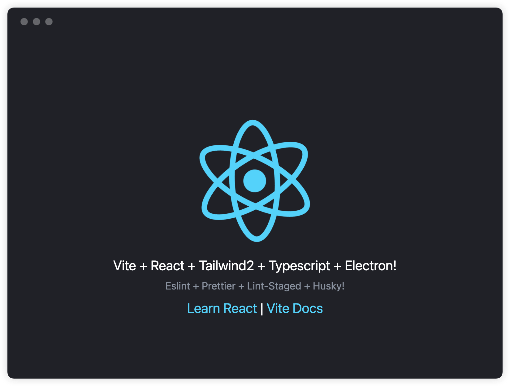

<p align="center">
  <a href="" rel="noopener">
 </a>
</p>

<h3 align="center">Vite React Typescript Electron Tailwind Starter</h3>

<div align="center">

[]()

</div>

---

<p align="center"> 
  This starter is fully functional scaffold, used Vite, React, Typescript, TailWind, Prettier, Eslint, Husky, you only need a little bit time to integrate
</p>

## 📝 Table of Contents

- [Getting Started](#getting_started)
- [Dependent version](#dependent_version)
- [Authors](#authors)

## 🏁 Getting Started <a name = "getting_started"></a>

### Dependent Version <a name = "dependent_version"></a>

```
react: 17.0.0
electron: 13.1.4
tailwindcss: 2.2.4
vite: 2.3.8
```

### Installing

Clone this repo

```
git clone htthttps://github.com/taixw2/electron-vite-react-starter.git
```

Install deps

```
npm install
# or
yarn install
```

## ✍️ Authors <a name = "authors"></a>

- [@Xin Ouyang](https://github.com/taixw2)
